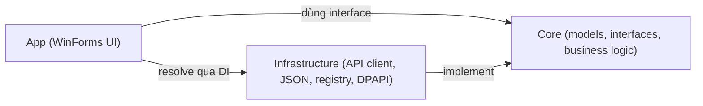

# 01. Giới thiệu & Kiến trúc tổng quan

> Đọc xong tài liệu này bạn sẽ hiểu: ProxyManager dùng để làm gì, gồm những project nào, dữ liệu được lưu/lấy ở đâu, và các thành phần được "nối dây" (dependency injection) với nhau như thế nào.

## 1. ProxyManager là gì?

**ProxyManager** (tên assembly: `ProxyManager.App`) là một ứng dụng desktop Windows (WinForms, .NET 8) do **HomeProxy** phát hành. Người dùng cuối (khách mua proxy từ các đại lý HomeProxy) cài ứng dụng này để:

1. Mua / quản lý proxy (proxy tĩnh, proxy datacenter, proxy xoay) thông qua backend **HomeProxy API**.
2. Gán từng proxy cho một ứng dụng cụ thể trên máy (browser, tool, hoặc **giả lập Android** như Bluestacks/Nox/LDPlayer/Memu) — mỗi app/giả lập sẽ ra Internet bằng đúng proxy được gán, app khác vẫn dùng mạng thật.
3. Việc "bắt" traffic theo từng app không phải do ProxyManager tự làm — nó điều khiển một phần mềm thứ ba tên **Proxifier** để làm việc đó (xem [05-proxifier-integration.md](05-proxifier-integration.md)).

Ứng dụng được đóng gói thành 1 file `.exe` duy nhất và có thể **tự mang theo .NET runtime** (self-contained) để người dùng cuối không cần cài .NET — xem [06-build-and-release.md](06-build-and-release.md).

## 2. Solution gồm 4 project

```
src/
  NetAgent.ProxyManager.Core/            Model, interface, business logic thuần (không phụ thuộc UI/HTTP/registry)
  NetAgent.ProxyManager.Infrastructure/   Cài đặt thật: gọi API backend, đọc/ghi JSON, DPAPI, Windows Registry
  NetAgent.ProxyManager.App/              WinForms UI + Program.cs (nơi "nối dây" toàn bộ ứng dụng)
  NetAgent.ProxyManager.Tests/            Unit test (xUnit)
```

Nguyên tắc: **Core không biết gì về HTTP, file, hay registry** — nó chỉ khai báo interface (`IProxyRepository`, `IApplicationRuleRepository`, `IProxifierService`, ...) và một số logic nghiệp vụ thuần Việt (tính toán, validate). **Infrastructure** mới là nơi implement thật các interface đó. **App** chỉ lo giao diện và lắp ráp (Program.cs) — nó gọi vào Core/Infrastructure qua interface, không tự làm việc gọi API/đọc file trực tiếp.



## 3. Hai luồng lưu dữ liệu song song

Ứng dụng lưu dữ liệu ở 2 nơi khác nhau, tuỳ loại dữ liệu:

| Loại dữ liệu | Lưu ở đâu | Class chính |
|---|---|---|
| Proxy tự thêm tay, application rules, cài đặt app, session đăng nhập (mã hoá DPAPI) | File JSON local, dưới `%AppData%\ProxyManager\` (đường dẫn tập trung ở `AppDataPaths.cs`) | `JsonProxyRepository`, `JsonApplicationRuleRepository`, `SecureLocalSecretStore` |
| Proxy đã mua (order), sản phẩm, lịch sử mua/giao dịch, thông tin tài khoản | Gọi REST API backend HomeProxy | `HomeProxyOrderApiClient`, `HomeProxyAuthApiClient`, `HomeProxyDepositApiClient` |

Dữ liệu người dùng (proxy tự thêm, application rules) còn được **tách theo từng tài khoản đăng nhập** — mỗi user có 1 thư mục con riêng (`users/<key>/...`), do `AuthenticatedUserStorageScope.cs` quyết định. Nếu chưa đăng nhập, dữ liệu rơi vào một scope "ẩn danh" chung.

Mọi request gọi backend đều đi qua `IHttpClientFactory`, có 2 "chốt chặn" (`DelegatingHandler`) gắn tự động:
- `MerchantHeaderHandler` — gắn header `x-merchant-id` để backend biết request này thuộc đại lý nào (xem [07-branding-assets.md](07-branding-assets.md)).
- `BearerTokenHandler` — gắn access token, tự refresh token khi gặp lỗi 401.

## 4. Wiring / Dependency Injection

Không có project "Installers" hay module DI riêng — toàn bộ việc đăng ký service nằm trong **`src/NetAgent.ProxyManager.App/Program.cs`**, dùng `Microsoft.Extensions.Hosting` (`Host.CreateDefaultBuilder().ConfigureServices(...)`). Quy tắc chung:

- Repository/Service (đọc file, gọi API, điều khiển Proxifier...) → đăng ký `AddSingleton` (sống suốt đời ứng dụng, giữ state chung).
- Form (dialog) → `AddTransient` (mỗi lần mở là 1 instance mới).
- Các control ứng với từng tab sidebar (`ApplicationRulesControl`, `ProxyOrdersControl`, `ProxyListControl`, `ProductPurchaseControl`, `StatusBarControl`) → cũng khai báo `AddTransient`, nhưng `MainForm` chỉ resolve 1 lần khi khởi động (`_serviceProvider.GetRequiredService<T>()`) và giữ lại trong field, nên thực tế dùng như singleton theo phiên làm việc.

`MainForm` là "composition root" của tầng UI: nó nhận khoảng 18 dependency qua constructor (toàn bộ là interface từ `Core/Interfaces`), và **không bao giờ tự gọi HTTP hay đọc file trực tiếp** — luôn đi qua service/repository được inject vào.

## Đọc tiếp

- [02-getting-started.md](02-getting-started.md) — cài môi trường, build, chạy, debug lần đầu.
- [03-sidebar-tabs-data-flow.md](03-sidebar-tabs-data-flow.md) — chi tiết từng tab trong sidebar.
