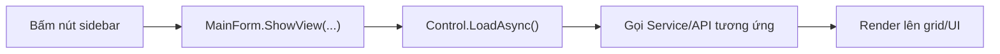

# 03. Luồng dữ liệu các tab trong Sidebar

> Đọc xong tài liệu này bạn sẽ biết: mỗi mục trong sidebar hiển thị gì, lấy dữ liệu từ đâu, và các action chính người dùng có thể làm ở từng tab.

## 1. Cơ chế chung: `MainForm` và việc chuyển tab

Toàn bộ khung UI (sidebar, header, vùng nội dung) nằm trong **`src/NetAgent.ProxyManager.App/Forms/MainForm.cs`**. Mỗi nút sidebar tương ứng với 1 `Control` đã được tạo sẵn (qua DI) và giữ trong field của `MainForm`. Khi bấm 1 nút sidebar:

1. `MainForm.ShowView(control, button, title)` — set tiêu đề header, xoá control cũ trong vùng nội dung, add control mới vào, style lại nút được chọn.
2. Ngay sau đó, `MainForm` gọi `LoadAsync()` (hoặc tương đương) trên control đó để **load lại dữ liệu mỗi lần mở tab** — dữ liệu không được cache sẵn từ lúc khởi động app.

Các control cũng bắn event lên `MainForm` để **điều hướng chéo** giữa các tab, ví dụ: từ tab "Proxy của tôi" bấm "Xem ứng dụng đang dùng proxy này" sẽ tự nhảy sang tab "Ứng dụng" và lọc sẵn theo proxy đó.

## 2. Tab "Ứng dụng" — `ApplicationRulesControl`

- **Hiển thị**: bảng các "application rule" — mỗi dòng là 1 app hoặc 1 giả lập đã được thêm vào để gán proxy, kèm trạng thái bật/tắt, proxy đang gán, cảnh báo (nếu có).
- **Dữ liệu**: đọc/ghi file JSON local qua `ApplicationRuleService` → `IApplicationRuleRepository` (`JsonApplicationRuleRepository`). Ngoài ra còn gọi `IApplicationRuntimeController`/`IAppProcessScanner` để biết app có đang chạy hay không, và gọi backend (`IProxyOrderApiClient`) để phát hiện proxy đã hết hạn/bị gỡ.
- **Action chính**: thêm app/giả lập (`AddApplicationRuleForm`), sửa đường dẫn app thường (`ApplicationRuleEditorForm`), gán/đổi proxy (`ChangeApplicationProxyForm`), bật/tắt rule, start/stop app thường, tìm kiếm/lọc.
- Chi tiết đầy đủ về flow thêm app + gán proxy: xem [04-application-proxy-assignment.md](04-application-proxy-assignment.md).

## 3. Tab "Proxy Tĩnh" / "Proxy Datacenter" / "Proxy Xoay" — `ProxyOrdersControl`

Cả 3 tab này dùng **chung 1 class** `ProxyOrdersControl`, chỉ khác tham số `Configure(ProxyOrderKind.Static/Datacenter/RotateProxy)` — vì UI/logic 3 loại proxy giống nhau, chỉ khác category gọi API.

- **Hiển thị**: danh sách proxy **đã mua** (order) thuộc loại tương ứng, cùng trạng thái, protocol, app nào đang dùng.
- **Dữ liệu**: 100% gọi backend qua `IProxyOrderApiClient` (`HomeProxyOrderApiClient`). Cần đăng nhập — nếu chưa login sẽ hiện màn hình trống kèm nút đăng nhập.
- **Action chính**: Refresh, Check proxy (kiểm tra còn sống), Đổi thông tin, Gia hạn (mở `RenewProxyOrdersForm`), Xoay proxy (mở `ProxyRestartConfirmationForm` nếu có app đang dùng — cảnh báo app sẽ bị restart), Lấy proxy từ key (`FetchProxyFromKeyForm`), Copy, Mua thêm (nhảy sang tab "Mua hàng").

## 4. Tab "Proxy của tôi" — `ProxyListControl`

- **Hiển thị**: danh sách proxy người dùng **tự thêm tay** (không phải mua qua HomeProxy) — dùng khi khách có proxy riêng muốn gán cho app.
- **Dữ liệu**: file JSON local qua `ProxyManagementService` → `IProxyRepository` (`JsonProxyRepository`). Thông tin "app nào đang dùng proxy này" lấy từ `IApplicationRuleRepository`.
- **Action chính**: thêm 1 proxy (`AddProxyForm`), import nhiều proxy cùng lúc (`BulkImportProxyForm`), sửa (`ProxyEditorForm`), xoá, check còn sống (`IProxyChecker`), copy, xem app đang dùng.

## 5. Tab "Mua hàng" — `ProductPurchaseControl`

- **Hiển thị**: catalog sản phẩm proxy (loại, protocol, khu vực, thời hạn, số lượng), giá, và 2 tab con lịch sử (Lịch sử mua hàng / Lịch sử giao dịch, dùng `HistoryListControl` — không phải tab sidebar riêng, chỉ là control con nhúng bên trong).
- **Dữ liệu**: backend qua `IProxyOrderApiClient` (`GetProductsAsync`, `GetDiscountRulesAsync`, `CreateOrderAsync`).
- **Action chính**: chọn sản phẩm/protocol/khu vực/thời hạn/số lượng → Mua (tạo order). Nếu không đủ tiền → Nạp tiền (mở `DepositAmountForm` → `DepositQrPaymentForm`, quét QR nạp coin).

## 6. Tab "Thiết lập"

Đây **không phải** một `Control` riêng như các tab trên — nó được build inline trong `MainForm.BuildSettingsTab()`, gồm 3 khối:
- Thông tin tài khoản (đổi tên hiển thị/email — `IAuthService.UpdateCurrentUserAsync`).
- Đổi mật khẩu (`IAuthService.ChangePasswordAsync`).
- Cài đặt chung: license key Proxifier, trạng thái Proxifier, tuỳ chọn "tự restart app sau khi đổi proxy" (lưu qua `IAppSettingsRepository`).

## 7. Ghi chú: `StatusBarControl`

`StatusBarControl` được inject vào `MainForm` nhưng thực chất **không làm gì** — `Height = 0`, `Visible = false`, `SetStatus()` để trống. Coi như UI "chết", chưa được implement thật. Nếu sau này cần thanh trạng thái thật (ví dụ hiển thị "Đang đồng bộ...", lỗi kết nối...), đây là chỗ cần code tiếp, không phải thêm control mới.

## Đọc tiếp

- [04-application-proxy-assignment.md](04-application-proxy-assignment.md) — chi tiết flow thêm app/giả lập và gán proxy.
