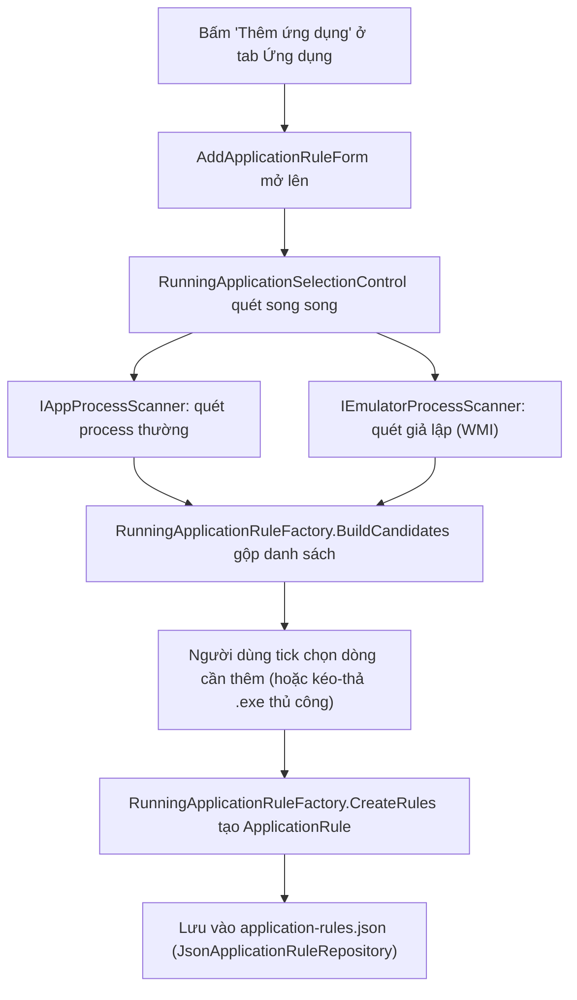

# 04. Flow thêm ứng dụng & gán Proxy

> Đọc xong tài liệu này bạn sẽ hiểu: cách 1 app/giả lập được thêm vào danh sách, vì sao app thường được nhận diện theo **đường dẫn file .exe** còn giả lập (Bluestacks/Memu/Nox/LDPlayer) được nhận diện theo **PID (process id)**, và cách proxy được gán/giữ ổn định khi giả lập bị tắt/mở lại.

## 1. Model trung tâm: `ApplicationRule`

File: `src/NetAgent.ProxyManager.Core/Models/ApplicationRule.cs`. Mỗi dòng trong tab "Ứng dụng" là 1 `ApplicationRule`, có 1 field `TargetType` quyết định rule này thuộc loại nào:

```csharp
enum ApplicationTargetType { Executable, Emulator }
```

| Field | Dùng cho `Executable` | Dùng cho `Emulator` |
|---|---|---|
| `ExecutableName` | ✅ đường dẫn đầy đủ file .exe | ❌ không dùng |
| `ProcessId` | ❌ không có | ✅ PID hiện tại (có thể `null` nếu giả lập đang tắt) |
| `EmulatorKind` | ❌ | ✅ Bluestacks / Memu / Nox / LDPlayer |
| `EmulatorInstanceKey` / `EmulatorInstanceName` | ❌ | ✅ định danh **bền vững**, không đổi khi giả lập restart |
| `AssignedProxyId`, `IsEnabled`, `Warning` | ✅ | ✅ |

## 2. Vì sao app thường dùng path, giả lập dùng PID?

- App thường (Chrome, 1 tool nào đó...): mỗi app có 1 đường dẫn `.exe` cố định trên máy → dùng path làm định danh là đủ, ổn định, và Proxifier match theo path/tên file rất tự nhiên.
- Giả lập Android: khi bạn mở **nhiều instance** của cùng 1 loại giả lập (ví dụ mở 3 cửa sổ Bluestacks), tất cả instance đó **chạy chung 1 process "host" có cùng tên và cùng đường dẫn file**. Path lúc này không phân biệt được instance nào là instance nào — chỉ **PID** (khác nhau cho mỗi instance đang chạy) mới phân biệt được.

Process "host" thật sự đứng ra tạo network traffic của từng loại giả lập (không phải file launcher/UI mà bạn bấm để mở giả lập):

| Giả lập | Tên process host |
|---|---|
| BlueStacks | `HD-Player.exe` |
| LDPlayer | `LdVBoxHeadless.exe` / `Ld9BoxHeadless.exe` / `VBoxHeadless.exe` (phải kèm điều kiện path/cmdline chứa "LDPlayer"/"leidian") |
| MEmu | `MEmuHeadless.exe` |
| Nox | `NOXVM.exe` / `NoxVMHandle.exe` |

Việc nhận diện này nằm ở `EmulatorProcessScanner.TryClassifyRuntimeProcess` (`src/NetAgent.ProxyManager.Core/Services/EmulatorProcessScanner.cs`).

**Nhưng PID lại đổi mỗi khi giả lập bị tắt/mở lại** — nên chỉ dùng PID làm định danh lâu dài thì rule sẽ "lạc mất" giả lập sau mỗi lần restart. Vì vậy `EmulatorProcessScanner` còn tính ra một **định danh bền vững** cho từng instance — `EmulatorInstanceKey`/`EmulatorInstanceName` — bằng cách đọc:
- tham số `--instance` trên command line,
- registry (BlueStacks: `SOFTWARE\BlueStacks_nxt`, LDPlayer: `SOFTWARE\XuanZhi`),
- tên thư mục VM (`leidian*`, `MemuHyperv VMs\*`, `BignoxVMS\*`),
- hoặc file config riêng của từng giả lập (`bluestacks.conf`, file `.config`/`.memu`/`.vbox`...).

Tóm lại: **`ProcessId` = định danh "đang chạy" (đổi theo mỗi lần mở), `EmulatorInstanceKey`/`EmulatorInstanceName` = định danh "đây là instance nào" (không đổi)**.

## 3. Flow thêm app/giả lập vào danh sách



Điểm quan trọng: nếu người dùng **kéo-thả hoặc browse chọn tay 1 file `.exe`**, kết quả luôn là rule loại `Executable` — không có đường nào tạo rule `Emulator` bằng tay, vì `ProcessId` chỉ có ý nghĩa khi lấy từ 1 process đang chạy thật.

**Bẫy launcher process:** mỗi giả lập còn có 1 process launcher/UI riêng, chạy song song với process host (ví dụ LDPlayer có `dnplayer.exe` chạy cùng `Ld9BoxHeadless.exe`). Launcher này **không** phải process host nên không được `TryClassifyRuntimeProcess` nhận diện, và vì mọi instance cùng loại giả lập đều dùng chung 1 đường dẫn launcher, nếu người dùng lỡ tick chọn dòng launcher trong danh sách "Thêm ứng dụng" thì rule tạo ra sẽ là `Executable` theo path — áp dụng chung cho **tất cả** instance thay vì phân biệt theo PID, và cũng không còn được loại khỏi popup restart (chỉ rule `Emulator` mới được loại). `EmulatorLauncherProcesses` (`src/NetAgent.ProxyManager.Core/Services/EmulatorLauncherProcesses.cs`) liệt kê các tên process launcher đã biết theo từng `EmulatorKind`; `RunningApplicationRuleFactory.BuildCandidates` dùng danh sách này để ẩn launcher khỏi danh sách chọn khi process host cùng loại đã được nhận diện trong cùng lượt quét, và `ApplicationRuleEligibility.Evaluate` dùng lại danh sách này để đánh dấu Cảnh báo cho rule `Executable` nào lỡ trỏ vào 1 launcher đã biết (kể cả rule cũ tạo trước khi có exclusion này, hoặc tạo bằng kéo-thả/browse tay).

Khi tạo rule (`RunningApplicationRuleFactory.CreateRules`, `src/NetAgent.ProxyManager.Core/Services/RunningApplicationRuleFactory.cs`), logic rẽ nhánh đơn giản:

```csharp
if (candidate.Emulator is { } emulator)
{
    // Tạo rule Emulator: lưu ProcessId + EmulatorInstanceKey/Name, IsEnabled = false ban đầu
}
else
{
    // Tạo rule Executable: lưu ExecutableName (full path), IsEnabled = false ban đầu
}
```

## 4. Gán proxy cho 1 rule

Có 2 cách gán, đều xử lý qua `ApplicationRuleService` (`src/NetAgent.ProxyManager.Core/Services/ApplicationRuleService.cs`):

- **Gán tay**: bấm "Gắn Proxy"/"Đổi Proxy" trên `ApplicationRulesControl` → mở `ChangeApplicationProxyForm` → chọn proxy → set `rule.AssignedProxyId`, `rule.AutoAssignProxy = false`.
- **Gán tự động (round-robin)**: nút "Auto-assign" → `RoundRobinProxyAssignmentService` chia đều các proxy khả dụng lần lượt cho các rule đang bật và có `AutoAssignProxy = true`.

Sau khi gán, `ApplicationRuleEligibility.Evaluate` (`src/NetAgent.ProxyManager.Core/Services/ApplicationRuleEligibility.cs`) quyết định rule có **đủ điều kiện dùng proxy** hay không:

| Điều kiện | Executable | Emulator |
|---|---|---|
| Định danh hợp lệ | `ExecutableName` không rỗng | `ProcessId` phải > 0 (đang chạy) |
| Proxy được gán | tồn tại, có endpoint hợp lệ, chưa hết hạn | (giống) |

→ **Một giả lập đang tắt (không có PID) sẽ không đủ điều kiện auto-assign hay dùng proxy**, cho tới khi được mở lại và app quét thấy PID mới.

## 5. Giả lập restart → PID mới, làm sao giữ đúng proxy đã gán?

`ApplicationRuleService.RefreshEmulatorRuntimeTargetsAsync` chạy trước mỗi lần sinh profile Proxifier hoặc bắt đầu session proxy — nó:

1. Quét lại toàn bộ giả lập đang chạy (`IEmulatorProcessScanner.ScanAsync`).
2. Với mỗi rule loại `Emulator` đã lưu, tìm candidate mới khớp theo thứ tự ưu tiên: `EmulatorInstanceKey` + tên process → cmdline chứa instance key (fallback cũ) → `EmulatorInstanceName` + tên process → (chỉ khi rule chưa từng có định danh) lấy candidate duy nhất cùng loại.
3. Khớp được → cập nhật `ProcessId` mới vào **đúng rule cũ** (giữ nguyên `AssignedProxyId`, `IsEnabled`). Không khớp được → `ProcessId = null`, rule tạm thành "chưa đủ điều kiện" cho tới khi giả lập đó mở lại.

Quan trọng: hệ thống **không** tự gán bừa 1 instance đang chạy cùng loại cho 1 rule đã có định danh riêng mà đang tắt (ví dụ Nox instance #0 đang tắt sẽ không bị gán nhầm sang PID của Nox instance #1 đang chạy) — logic này được test khoá lại ở `ApplicationRuleServiceTests`.

> **Lưu ý:** app **không tự start/stop được giả lập** (`ApplicationRuntimeController` từ chối thẳng khi gặp rule `Emulator`, báo "Chưa hỗ trợ tắt/mở emulator trong phiên bản này"). Việc mở/tắt giả lập luôn do người dùng làm tay — app chỉ *phát hiện lại* PID mới sau đó. Ngược lại, app thường (`Executable`) thì có thể tự kill + mở lại (`ApplicationRuntimeController.RestartIfRunningAsync`) để áp dụng proxy mới ngay.

## Đọc tiếp

- [05-proxifier-integration.md](05-proxifier-integration.md) — proxy được "gán" thật sự bằng cách nào (Proxifier + Proxification Rule).
- [08-adding-new-emulator.md](08-adding-new-emulator.md) — hướng dẫn thêm hỗ trợ 1 loại giả lập mới.
