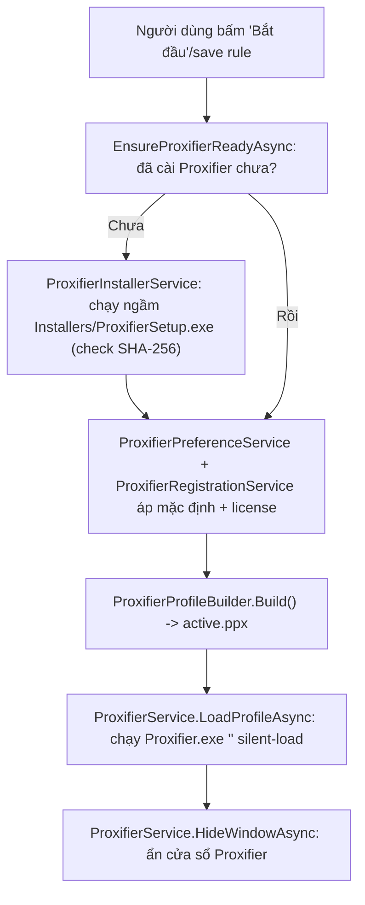

# 05. Proxifier đóng vai trò gì?

> Đọc xong tài liệu này bạn sẽ hiểu: vì sao app cần một phần mềm thứ ba tên Proxifier, ProxyManager điều khiển nó bằng cách nào, và "Proxification Rule" nghĩa là gì.

## 1. Vì sao cần Proxifier?

ProxyManager **tự nó không có khả năng chặn/định tuyến traffic mạng theo từng ứng dụng** — đó là một việc ở tầng hệ điều hành rất phức tạp (system-wide hook/driver). Thay vì tự viết, app dùng **[Proxifier](https://www.proxifier.com/)** — một phần mềm Windows chuyên làm đúng việc này: "app A đi qua proxy X, app B đi thẳng (Direct), app C đi qua proxy Y...".

Nói đơn giản: **Proxifier là "cái máy" thật sự ép traffic đi qua proxy theo từng app. ProxyManager là "bộ điều khiển" của cái máy đó** — nó lo:
1. Cài Proxifier (âm thầm, người dùng không thấy) nếu máy chưa có.
2. Sinh ra 1 file cấu hình (profile `.ppx`) mô tả app nào đi proxy nào, dựa trên danh sách rule ở tab "Ứng dụng".
3. Nạp file đó vào Proxifier và **ẩn cửa sổ Proxifier đi** — người dùng cuối chỉ thấy ProxyManager, không biết có Proxifier chạy ngầm bên dưới.

## 2. Các service liên quan

| Class | Vai trò |
|---|---|
| `ProxifierProfileBuilder` (Core) | Biến danh sách proxy + application rule thành XML profile `.ppx` |
| `ProxifierService` (Core) | Điều khiển process `Proxifier.exe` đã cài: tìm đường dẫn cài đặt, nạp profile (`silent-load`), ẩn/hiện cửa sổ, kill process |
| `ProxifierSessionService` (Core) | Gộp 2 class trên thành "bắt đầu/dừng session proxy" — đây là entry point UI gọi |
| `ProxifierInstallerService` (Infrastructure) | Cài Proxifier âm thầm từ file bundled (`Installers\ProxifierSetup.exe`), có kiểm tra SHA-256 trước khi chạy |
| `ProxifierRegistrationService` (Infrastructure) | Nhập license key để Proxifier chạy bản đã đăng ký, không chạy bản trial |
| `ProxifierPreferenceService` (Infrastructure) | Áp cấu hình mặc định cho end-user: bật tray icon, tắt tự-chạy-cùng-Windows của Proxifier |

## 3. Proxification Rule là gì? (giải thích cho intern)

Mỗi **Proxification Rule** = 1 dòng luật, trả lời câu hỏi: *"traffic của app/tiến trình nào thì đi qua proxy nào?"*. Trong file `.ppx` (XML), mỗi rule gồm:

- **Applications**: điều kiện match — có thể là **tên/đường dẫn file .exe** (app thường), hoặc **`pid=<số>`** (giả lập — xem [04-application-proxy-assignment.md](04-application-proxy-assignment.md) để hiểu vì sao).
- **Action**: `Proxy <id>` (đi qua proxy nào) hoặc `Direct`/`Block`.
- **Name**: tên hiển thị (cho dễ đọc trong Proxifier, không ảnh hưởng logic).

`ProxifierProfileBuilder` luôn sinh ra 3 nhóm rule theo đúng thứ tự (Proxifier xét rule **từ trên xuống**, dừng ở rule đầu tiên match):

1. **Rule "Localhost"** (luôn có, cố định) — `localhost; 127.0.0.1; %ComputerName%; ::1` → **Direct**. Đảm bảo traffic nội bộ máy không bị ép qua proxy, tránh lỗi lung tung.
2. **1 rule cho mỗi `ApplicationRule` đang bật (`IsEnabled = true`)** — match theo path hoặc `pid=...`, action = `Proxy <id-của-proxy-được-gán>`.
3. **Rule "Default"** (luôn có, cuối cùng) — bắt hết traffic còn lại chưa khớp rule nào → `Direct` hoặc `Block`, tuỳ cấu hình `AppSettings.DefaultRouteDirect`.

Ví dụ rút gọn (giá trị minh hoạ, không phải config thật):

```xml
<RuleList>
  <Rule enabled="true">
    <Applications>localhost; 127.0.0.1; %ComputerName%; ::1</Applications>
    <Action type="Direct" />
    <Name>Localhost</Name>
  </Rule>
  <Rule enabled="true">
    <Applications>"C:\Program Files\Google\Chrome\Application\chrome.exe"</Applications>
    <Action type="Proxy">100</Action>
    <Name>chrome.exe</Name>
  </Rule>
  <Rule enabled="true">
    <Applications>pid=1234</Applications>
    <Action type="Proxy">101</Action>
    <Name>LDPlayer 1</Name>
  </Rule>
  <Rule enabled="true">
    <Action type="Direct" />
    <Name>Default</Name>
  </Rule>
</RuleList>
```

Vài quy tắc validate trước khi build profile (nếu vi phạm sẽ báo lỗi, không sinh profile):
- Rule `Executable` đang bật phải có `ExecutableName` không rỗng.
- Rule `Emulator` đang bật phải có `ProcessId` hợp lệ (giả lập phải đang chạy).
- Mọi rule đang bật phải có `AssignedProxyId` trỏ tới 1 proxy tồn tại.
- Danh sách `<ProxyList>` chỉ chứa proxy **đang thực sự được rule nào đó dùng** (không đẩy dư proxy chưa dùng vào profile).
- Trên UI khi xem trước file (preview), mật khẩu proxy được **che thành `****`** (`MaskedPreviewXml`) — file thật lưu trên đĩa (`active.ppx`) mới có password thật, để Proxifier đọc được.

## 4. Vòng đời: cài đặt → sinh profile → nạp vào Proxifier



Khi người dùng "Dừng": sinh 1 profile trống/chỉ Direct (`inactive.ppx`), nạp lại theo cách tương tự, rồi kill toàn bộ process Proxifier (`StopProcessesAsync`).

## 5. ⚠️ Lưu ý an toàn

`appsettings.json` phần `Proxifier` hiện đang có `RegistrationOwner`/`RegistrationKey` **hardcode thẳng trong file** (đây là license key thật của Proxifier). Trước khi đưa repo này public hoặc chia sẻ rộng, nên chuyển 2 giá trị này ra biến môi trường / user-secrets thay vì để trong file JSON commit vào git.

## Đọc tiếp

- [06-build-and-release.md](06-build-and-release.md) — build & đóng gói app cho end-user.
