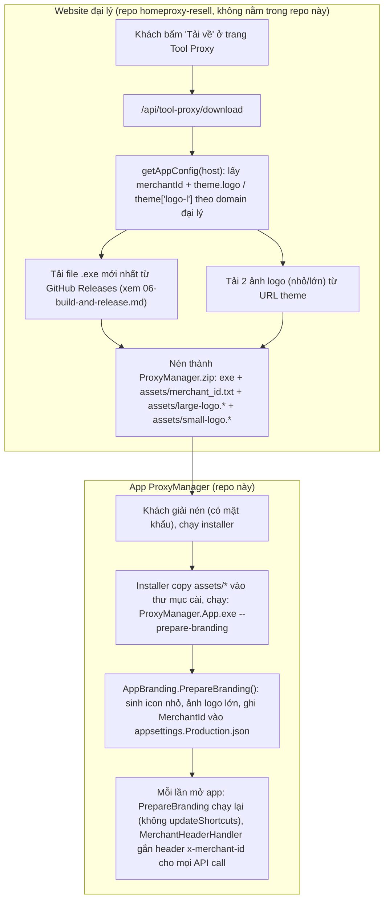

# 07. Luồng gán Logo & Merchant ID (branding theo đại lý)

> Đọc xong tài liệu này bạn sẽ hiểu: vì sao mỗi đại lý tải app về lại thấy logo/thương hiệu của chính họ, và làm sao backend biết 1 lượt cài app thuộc đại lý nào.

## 1. Toàn cảnh: từ web đại lý tới app trên máy khách

## 2. Phía website đại lý làm gì (tham khảo, không sửa ở đây)

File liên quan (repo `homeproxy-resell`):
- `src/app/api/tool-proxy/download/route.ts` — endpoint xử lý toàn bộ flow tải.
- `src/lib/get-app-config.ts` — tra cấu hình đại lý (merchant) theo domain đang truy cập, trả về `theme.logo` (logo nhỏ) và `theme['logo-l']` (logo lớn) cùng `merchantId`.
- `src/lib/tool-proxy/logo-assets.ts` — tải file ảnh logo thật từ URL theme về.
- `src/lib/tool-proxy/zip.ts` — nén file `.exe` + `assets/merchant_id.txt` + 2 file logo thành 1 file `ProxyManager.zip` (có mật khẩu, xem hằng số `TOOL_PROXY_ZIP_PASSWORD`).

→ Kết quả: mỗi đại lý sẽ có 1 file zip **khác nhau** (khác merchant_id.txt, khác logo), dù file `.exe` bên trong là **giống nhau 100%** cho mọi đại lý.

## 3. Phía app ProxyManager tiêu thụ file logo/merchant_id thế nào

File chính: **`src/NetAgent.ProxyManager.App/Theme/AppBranding.cs`**. Gọi từ `Program.cs`:
- Nếu app chạy với cờ `--prepare-branding` (installer gọi sau khi cài xong) → chạy đầy đủ, kể cả cập nhật icon shortcut Start Menu/Desktop.
- Mỗi lần app khởi động bình thường → cũng gọi lại (không cập nhật shortcut) — để branding luôn đồng bộ nếu file assets có thay đổi.

`AppBranding.PrepareBranding()` làm 3 việc, độc lập nhau (1 việc lỗi không ảnh hưởng việc khác):

1. **Logo nhỏ**: tìm `assets/small-logo.*` → convert thành file `.ico` nhiều size (`small-logo.generated-<hash>.ico`) nằm cạnh file `.exe`. Dùng làm icon cửa sổ (`LoginForm`, `MainForm`) và icon sidebar khi thu nhỏ.
2. **Logo lớn**: tìm `assets/large-logo.*` → convert/copy thành `large-logo.generated-<hash>.png`. Dùng làm logo màn hình đăng nhập và logo lớn trên sidebar.
3. **Merchant ID**: đọc `assets/merchant_id.txt` (1 GUID), ghi đè vào `appsettings.Production.json` → khoá `BackendApi:MerchantId`.

Sau khi dùng xong, file gốc trong `assets/` bị xoá (`TryDeleteBrandingPayload`) — chỉ giữ lại file đã generate cạnh `.exe`.

> **Lưu ý bản single-file exe:** zip đại lý chỉ có `exe` + `assets/`, **không** kèm `appsettings.Production.json` trên đĩa. Vì vậy bước Merchant ID lấy JSON gốc từ **bản nhúng trong exe** (`EmbeddedAssets`) khi trên đĩa chưa có, rồi **ghi ra đĩa** `appsettings.Production.json` với merchant id của đại lý. Nhờ đó mỗi đại lý vẫn có merchant id riêng dù chỉ phát hành 1 file exe. Bước này chạy trong `Program.Main` **trước** khi nạp cấu hình, nên lần đọc config sau đó thấy đúng merchant id.

## 4. Merchant ID dùng để làm gì ở backend?

`BackendApiOptions.MerchantId` (đọc từ `appsettings.Production.json`) được `MerchantHeaderHandler` (`src/NetAgent.ProxyManager.Infrastructure/Api/MerchantHeaderHandler.cs`) tự động gắn thành header **`x-merchant-id`** trên **mọi** request gọi backend (auth, order, deposit...). Nhờ vậy, dù file `.exe` giống nhau cho mọi đại lý, backend HomeProxy vẫn biết chính xác lượt cài này thuộc đại lý nào — để tính hoa hồng, áp giá riêng, hiển thị đúng dữ liệu của đại lý đó, v.v.

## Đọc tiếp

- [08-adding-new-emulator.md](08-adding-new-emulator.md) — hướng dẫn thêm hỗ trợ giả lập mới.
